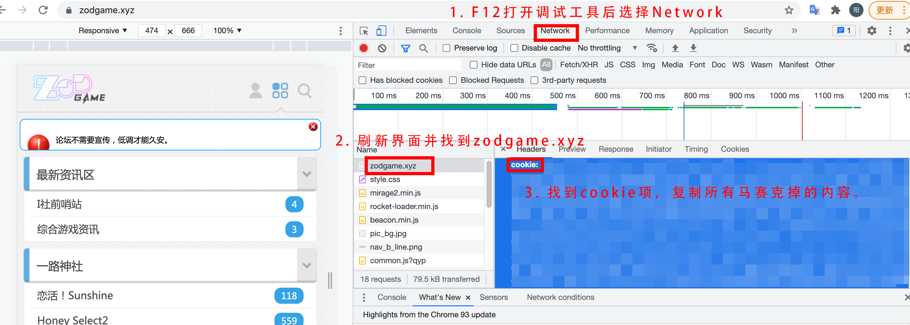
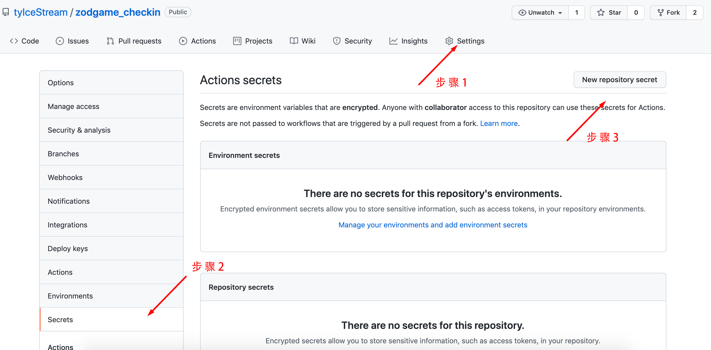

# zodgame_checkin
Zodgame automatic check-in using github action

### 1. 添加 Cookie 至 Secrets

- 首先通过F12抓取到Cookie，随后在项目页面，依次点击`Settings`-->`Secrets`-->`New secret`

  

- 建立名为`ZODGAME_COOKIE`的 secret，值为复制的`Cookie`内容，最后点击`Add secret`
- secret名字必须为`ZODGAME_COOKIE`！

  

  

### 2. 启用 Actions

- 本仓库 Actions 默认为关闭状态，需要通过 `Settings`-->`Actions`-->`Allow all actions`开启。（如果已经开启则忽略此项）
- 本项目由Workflow控制，每日8时自动执行。
- 本项目目前可以正常运行，如果有其他使用问题请在Issues留言。
